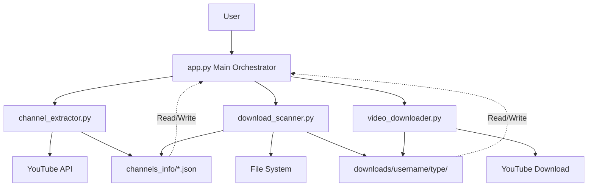

# 🏗️ System Architecture

## Overview

This is a modular YouTube channel video downloader system with clean separation of concerns.

## Component Diagram



## Data Flow

### First Time Download Flow

```
User Input (URL/Username)
    ↓
channel_extractor.py
    ↓
Extract Channel Info from YouTube
    ↓
Save to channels_info/username.json
    ↓
Ask: Download Now?
    ↓
Yes → download_scanner.py
    ↓
Scan Existing Downloads
    ↓
Create Download Queue
    ↓
video_downloader.py
    ↓
Multi-threaded Download
    ↓
Save to downloads/username/videos|shorts|streams/
```

### Subsequent Download Flow

```
User Input (URL/Username)
    ↓
Load channels_info/username.json
    ↓
Choose: Rescan or Download
    ↓
├─→ Rescan → channel_extractor.py → Update JSON → Exit
└─→ Download → download_scanner.py
        ↓
    Scan & Create Queue
        ↓
    video_downloader.py
        ↓
    Resume/Download Videos
```

## Module Responsibilities

### 1. `app.py` - Main Orchestrator
- **Purpose**: Coordinate all modules
- **Handles**: User interface, workflow control
- **Functions**:
  - Get user input
  - Check existing info files
  - Ask user for action (rescan/download)
  - Orchestrate the download process

### 2. `channel_extractor.py` - Channel Information
- **Purpose**: Extract and save channel metadata
- **Handles**: YouTube API interaction
- **Functions**:
  - Fetch channel info using yt-dlp
  - Categorize videos (videos, shorts, streams)
  - Save to JSON in channels_info/
  - Sanitize usernames for filenames

### 3. `download_scanner.py` - Download Tracking
- **Purpose**: Track which videos are already downloaded
- **Handles**: File system scanning
- **Functions**:
  - Check if video exists in downloads/
  - Scan all videos and identify missing ones
  - Create download queue
  - Generate download statistics

### 4. `video_downloader.py` - Download Engine
- **Purpose**: Multi-threaded video downloads
- **Handles**: Parallel downloads with yt-dlp
- **Functions**:
  - Download single video
  - Parallel downloads with thread pool
  - Progress tracking
  - Resume failed downloads
  - Organize by video type

## File Structure

```
resources/
│
├── Core Modules
│   ├── app.py                    # Main entry point
│   ├── channel_extractor.py      # Channel info extraction
│   ├── download_scanner.py       # Download tracking
│   └── video_downloader.py       # Download engine
│
├── Auto-created Directories
│   ├── channels_info/            # Channel metadata JSON files
│   │   └── {username}.json
│   │
│   └── downloads/                # Downloaded videos
│       └── {username}/
│           ├── videos/           # Regular videos
│           ├── shorts/           # Short videos
│           └── streams/          # Live streams
│
├── Documentation
│   ├── README_DOWNLOADER.md      # Full documentation
│   ├── QUICKSTART.md             # Quick start guide
│   ├── ARCHITECTURE.md           # This file
│   └── test_system.py            # System verification
│
└── Legacy Files (not used)
    ├── getInfo.py                # Old script (replaced by channel_extractor.py)
    ├── ElainaAly.json            # Old format (replaced by channels_info/)
    └── ...
```

## Data Structures

### Channel Info JSON (`channels_info/username.json`)

```json
{
  "channel_info": {
    "id": "...",
    "channel": "Channel Name",
    "channel_id": "...",
    "uploader_id": "@username",
    "channel_follower_count": 12345,
    "description": "...",
    "thumbnails": [...],
    "tags": [...]
  },
  "videos": [
    {
      "id": "VIDEO_ID",
      "title": "Video Title",
      "url": "https://youtube.com/watch?v=VIDEO_ID",
      "thumbnail": "...",
      "duration": 123,
      "view_count": 45678,
      "upload_date": "20240101"
    }
  ],
  "shorts": [...],
  "streams": [...]
}
```

### Video Info Object (TypedDict)

```python
class VideoInfo(TypedDict):
    id: str           # YouTube video ID
    title: str        # Video title
    url: str          # Full YouTube URL
    type: str         # 'videos', 'shorts', or 'streams'
```

## Key Features

### 1. Modular Design
- Each module has single responsibility
- Easy to maintain and extend
- Can be used independently

### 2. Intelligent Scanning
- Automatically detects already downloaded videos
- Skips duplicates
- Creates minimal download queue

### 3. Multi-threaded Downloads
- Configurable parallel downloads (1-10 threads)
- Thread-safe operations
- Progress tracking per video

### 4. Resume Capability
- Interrupted downloads can resume
- Failed downloads can retry
- No duplicate downloads

### 5. Organized Storage
- Separate folders by video type
- Consistent naming (video ID)
- Easy to manage and backup

## Configuration Points

### Thread Count
- Default: 3 threads
- Range: 1-10 threads
- Higher = faster but more resources

### Download Format
- Quality: Best available (video+audio merged)
- Container: MP4
- Naming: `{VIDEO_ID}.mp4`

### Directory Locations
- Channel info: `channels_info/`
- Downloads: `downloads/{username}/{type}/`

## Extension Points

### Adding New Features

**Custom Filters:**
Modify `download_scanner.py` to filter by:
- Date range
- View count
- Video duration
- Keywords

**Different Formats:**
Modify `video_downloader.py` ydl_opts:
```python
ydl_opts = {
    'format': 'best',  # Change quality
    'postprocessors': [...],  # Add converters
}
```

**Database Storage:**
Replace JSON files with SQLite:
- Modify `channel_extractor.py` save function
- Update `download_scanner.py` to query DB

## Performance Characteristics

### Speed
- Channel scan: ~5-30 seconds (depends on channel size)
- Download speed: Bandwidth × Threads (up to limit)
- File I/O: Minimal (only for tracking)

### Resource Usage
- Memory: Low (streaming downloads)
- CPU: Moderate (video merging)
- Network: High (bandwidth intensive)
- Disk: High (video storage)

### Scalability
- Handles channels with 1000+ videos
- Thread count adjustable for bandwidth
- No artificial limits on video count

## Error Handling

### Network Errors
- Retry failed downloads
- Skip unavailable videos
- Continue on transient errors

### File System Errors
- Create directories automatically
- Handle permission errors
- Validate disk space (future)

### YouTube API Errors
- Rate limiting handled gracefully
- Private/deleted videos skipped
- Extractor errors logged and continued

## Security Considerations

1. **Input Validation**: Usernames sanitized for filesystem
2. **Path Traversal**: Prevented by Path objects
3. **API Limits**: Respects YouTube rate limits
4. **Local Storage**: All data stored locally (no cloud)

## Future Enhancements

Potential improvements:
- [ ] Playlist support
- [ ] Subtitle download
- [ ] Thumbnail saving
- [ ] Metadata embedding
- [ ] Progress bar (TUI/GUI)
- [ ] Schedule downloads
- [ ] Auto-update channel info
- [ ] Web interface
- [ ] Database backend
- [ ] Video quality selection
